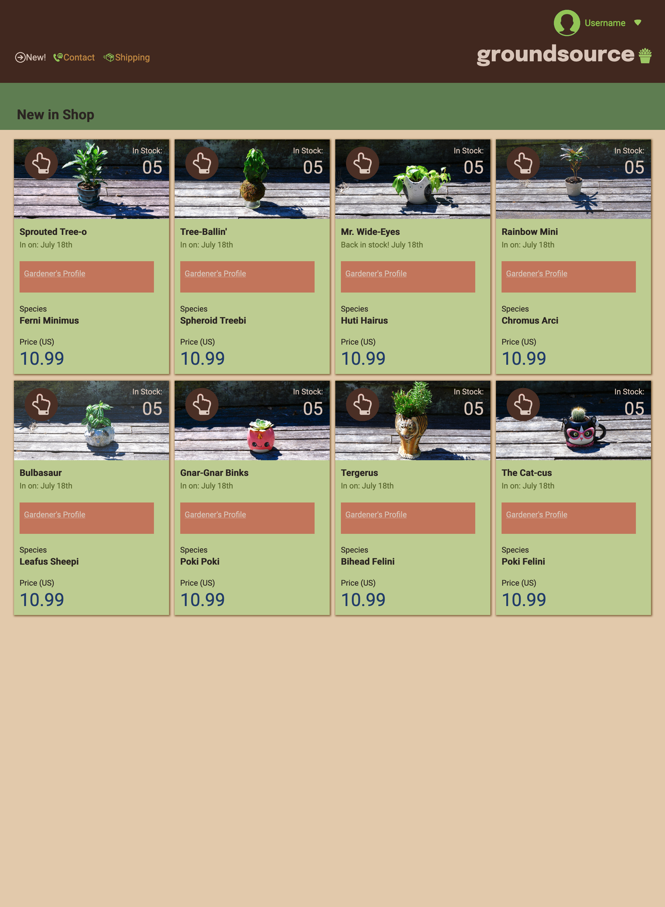

# My first composition challenge
> by: [Matthew Lane](https://github.com/GreyMatteOr)
---

### Introduction

In this challenge, I really got to test my strength in the arena of web design. I was relatively green in all matters HTML & CSS, but this was a great way to expose the gaps in my knowledge-base.

In this challenge, we were given a picture of a mock-website and asked to replicate it as closely as possible. Here is the challenge picture (left) side-by-side with a picture of my attempt (right).

There were a ton of learning moments: so many, that I wish I had the chance to try again and implement all the new techniques I've learned along the way. Though there are some minor cosmetic differences, I think the comparison speaks for itself how closely I was able to mimic the original comp.

There is also a much less visible challenge to get the website to display responsively under different screen sizes, and perhaps other conditions (though admittedly, at this point in my career, if there are other conditions I might have tried to adapt this site to handle, I don't know them).

### Techniques

During the challenge, I discovered some simple methods for design that I will never let go of. Unfortunately, this was only after but only after spending many, many iterations metaphorically banging my head against the computer screen.

The first that I loved: **Sketching**. Perhaps a little primitive, but I noticed it forced me to consider what role each piece of the design was playing. At this point, I really didn't know anything, and I'm certain that if I were to do something similar, I would have a much more discerning eye.

However, even within my unitiated ability, I still managed to distill the layout into it's biggest components (even recognizing certain major HTML elements) and it gave me direction. At the time, I wasn't sure it was worth the effort, but I made the decision to measure most of the pixel distances and I must say it really paid dividends. I discovered which elements were reusing fonts, and it made my styling decisions easier at a few points. There are some optimal HTML elements I might have missed or misused according to the highest end Semantic HTML theory, but that span of my ignorace is diminishing daily.

One thing I wish I had done, in hindsight, is to mock up how I wanted to handle the different sizes. As I designed my first iteration (namely, at normal screen dimensions, roughly 1188 x 1620) I did not take into consideration how I might want my screen to adapt. As a result, there were several times I had to redesign considerable parts of my site in order to achieve these adaptations. Next time, I will be intentional in my mock-up to these possible directions.

The second technique that I found great utility in: `grid`. I love grid. It took tens of hours to finally intuitively understand every moving part and learn how to wrangle it into the form that I needed. I loved adaptive grids using `repeat(auto, 1fr)`, and `grid-gap` makes spacing the rows and columns a treat. It took several attempts to discover how I wanted to space around the grid (I started out manually inputing empty rows), but once I got more comfortable, I used padding and margins.

I discovered all too late how CSS can take **variables** and even later how to make good use of them. It was such a headache have to update all the tiny pieces of styling every time I wanted a different font or color (especially in hex). But next time, I will declare them all at the head of the document and reuse the variables as necessary. This was totally possible since I did all of the work measuring pixels in the sketching phase, but one of the most permanent ways to learn is to pay an ignorance tax.

The third thing I finally *finally* started using to it's potential: **the inspector tool**. I wish I had started earlier! There were hours spent early on that I struggled in vane to learn why my styles weren't implementing the way I expected them to. Once I finally solved a convoluted styling dilemna easily, there was no turning back. It will probably be one of my first problem-solving tools from here on out.

The last thing that was very satisfying was learning about layering with the `z-axis` and `position: absolute`. I was lucky enough to decide to go straight to the documentation after it didn't initially work, so I sidestepped considerable frustration there. All in all, I think the overlays look great!

### Conclusion

All in all, though I spent considerable time on this project, I am very satisfied with the end-result, and even more satisfied with my newfound knowledge. I can't wait to try a more difficult challenge!
